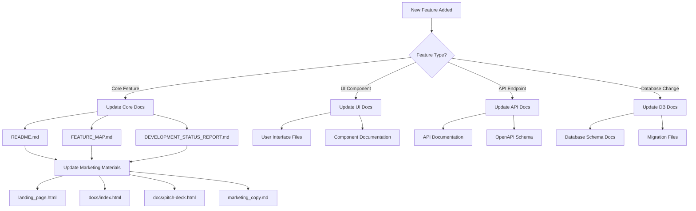

# 📊 Documentation Dependencies & Update Flowchart

## 🎯 Overview

This flowchart shows which documents and files need to be updated when changes are made to the Iterum R&D Chef Notebook application. Use this as a checklist to ensure all documentation stays synchronized.

---

## 🔄 **When Adding a New Feature**



---

## 📋 **Complete Update Checklist**

### **🏗️ Core Application Changes**

#### When Adding New Features:
1. **Core Documentation**
   - [ ] `README.md` - Add to features list
   - [ ] `FEATURE_MAP.md` - Add detailed feature description
   - [ ] `DEVELOPMENT_STATUS_REPORT.md` - Update progress metrics
   - [ ] `IMPROVEMENTS_SUMMARY.md` - Document what was added

2. **Technical Documentation**
   - [ ] `PROJECT_SYSTEM_IMPLEMENTATION.md` - If related to projects
   - [ ] `API_FIX_SUMMARY.md` - If API changes were made
   - [ ] `TESTING_GUIDE.md` - Add testing procedures

3. **User Guides**
   - [ ] `QUICK_START.md` - Update if user flow changes
   - [ ] `LAUNCHER_GUIDE.md` - Update if startup changes
   - [ ] Component-specific guides (e.g., `AUTO_SAVE_README.md`)

#### When Adding New Pages/Components:
1. **Navigation Updates**
   - [ ] `index.html` - Main app navigation
   - [ ] All page headers with navigation menus
   - [ ] `uniform-header-template.html` - Template updates

2. **Feature Documentation**
   - [ ] Create dedicated README for complex features
   - [ ] Update `FEATURE_MAP.md` with page details
   - [ ] Document any new JavaScript modules

### **🎨 UI/UX Changes**

#### When Updating Design:
1. **Brand Consistency**
   - [ ] `BRAND_GUIDE.md` - Update if colors/fonts change
   - [ ] `PLANT_SKETCHES_INTEGRATION.md` - If visual elements change
   - [ ] `HEADER_STANDARDIZATION_SUMMARY.md` - If headers change

2. **Responsive Design**
   - [ ] Test all pages listed in `DEVELOPMENT_STATUS_REPORT.md`
   - [ ] Update mobile-specific documentation

### **🔧 Backend/API Changes**

#### When Adding API Endpoints:
1. **API Documentation**
   - [ ] FastAPI auto-docs (automatically updated)
   - [ ] `apiConfig.js` - Add new endpoint configurations
   - [ ] Update any API integration guides

2. **Database Changes**
   - [ ] Create migration file in `migrations/`
   - [ ] Update `PROJECT_SYSTEM_IMPLEMENTATION.md` if project-related
   - [ ] Document schema changes

### **📱 Marketing & External Materials**

#### When Features Change:
1. **Public-Facing Content**
   - [ ] `landing_page.html` - Update features section
   - [ ] `docs/index.html` - Main marketing site
   - [ ] `docs/pitch-deck.html` - Investor presentation
   - [ ] `marketing_copy.md` - Marketing content
   - [ ] `social_media_copy.md` - Social media posts

2. **Business Documentation**
   - [ ] `INVESTOR_PITCH_DECK_CONTENT.md` - Investor materials
   - [ ] `FINANCIAL_PROJECTIONS.md` - If feature impacts business model
   - [ ] `INVESTOR_LETTER.md` - Update if major milestone

### **🔐 Security & Deployment**

#### When Security Changes:
1. **Security Documentation**
   - [ ] `HTTPS_DEPLOYMENT_GUIDE.md` - If security features added
   - [ ] `SECURE_ITERUMFOODS_GUIDE.md` - Production security
   - [ ] Update authentication guides

2. **Deployment Guides**
   - [ ] `DEPLOYMENT.md` - Production deployment
   - [ ] `CONFIGURATION.md` - Configuration options
   - [ ] Environment setup guides

---

## 🎯 **Feature-Specific Dependencies**

### **Recipe Management Features**
When updating recipe functionality:
- [ ] `FEATURE_MAP.md` → Recipe Management section
- [ ] `RECIPE_LIBRARY_GUIDE.md` - User guide
- [ ] `RECIPE_UPLOAD_REVIEW_FIX.md` - Upload process
- [ ] `AUTOMATED_WORKFLOW_README.md` - If workflow affected

### **Project System Features**
When updating project functionality:
- [ ] `PROJECT_SYSTEM_IMPLEMENTATION.md` - Main documentation
- [ ] `PROJECT_UI_COMPLETION_SUMMARY.md` - UI updates
- [ ] `MULTI_TENANT_ARCHITECTURE_PROPOSAL.md` - If architecture changes

### **Authentication Features**
When updating auth:
- [ ] `AUTH_MIGRATION_SUMMARY.md` - Authentication changes
- [ ] `DUAL_LOGIN_FIX.md` - Login system fixes
- [ ] `ADMIN_LOGIN_GUIDE.md` - Admin procedures

### **Equipment/Vendor Features**
When updating equipment/vendor management:
- [ ] `VENDOR_MANAGEMENT_GUIDE.md` - User guide
- [ ] `VENDOR_BRANDING_UPDATE.md` - UI/branding changes
- [ ] Equipment-related documentation

---

## 🚀 **Priority Update Order**

### **High Priority (Update First)**
1. `README.md` - Main project documentation
2. `FEATURE_MAP.md` - Feature tracking
3. `DEVELOPMENT_STATUS_REPORT.md` - Overall status
4. Core user guides for changed functionality

### **Medium Priority (Update Soon)**
1. Marketing materials (`landing_page.html`, `docs/index.html`)
2. API documentation and configuration files
3. Testing and deployment guides

### **Low Priority (Update Eventually)**
1. Social media content
2. Investor materials (unless major milestone)
3. Archive documentation

---

## 🔍 **File Relationships Map**

### **Core Application Files**
```
README.md
├── References: All major features
├── Links to: QUICK_START.md, LAUNCHER_GUIDE.md
└── Feeds into: Marketing materials

FEATURE_MAP.md
├── Details: All 17 core features
├── References: API endpoints, database tables
└── Updates: DEVELOPMENT_STATUS_REPORT.md

index.html (Main App)
├── Navigation: References all application pages
├── Features: Must match FEATURE_MAP.md
└── UI: Must match BRAND_GUIDE.md
```

### **Marketing Materials Chain**
```
FEATURE_MAP.md → DEVELOPMENT_STATUS_REPORT.md → Marketing Materials
                                                ├── landing_page.html
                                                ├── docs/index.html
                                                ├── docs/pitch-deck.html
                                                └── marketing_copy.md
```

### **Technical Documentation Chain**
```
Code Changes → Technical Docs → User Guides → Marketing
             ├── API docs      ├── README.md  └── External sites
             ├── Schema docs   ├── Guides     
             └── Config files  └── Tutorials   
```

---

## ✅ **Automation Opportunities**

### **Current Manual Updates Needed**
- [ ] Feature counts in marketing materials
- [ ] Progress percentages in status reports
- [ ] Navigation menu consistency
- [ ] Brand guideline adherence

### **Potential Automation**
1. **Feature Count Automation**: Script to count features and update docs
2. **Navigation Consistency**: Template system for headers
3. **Marketing Sync**: Automatic feature list generation
4. **Status Reports**: Automated progress calculation

---

## 🎯 **Quick Reference Checklists**

### **New Feature Checklist**
- [ ] Code implementation complete
- [ ] Add to `FEATURE_MAP.md`
- [ ] Update `README.md` features list
- [ ] Update `DEVELOPMENT_STATUS_REPORT.md` metrics
- [ ] Update marketing materials if user-facing
- [ ] Test navigation on all pages
- [ ] Update user guides if needed

### **UI Change Checklist**
- [ ] Check `BRAND_GUIDE.md` compliance
- [ ] Update all pages with navigation
- [ ] Test responsive design
- [ ] Update screenshots in documentation
- [ ] Check marketing material consistency

### **API Change Checklist**
- [ ] Update `apiConfig.js` if new endpoints
- [ ] Documentation auto-updates via FastAPI
- [ ] Test integration with frontend
- [ ] Update any API usage guides
- [ ] Check authentication flow

---

**💡 Pro Tip**: Keep this document open when making changes and use it as a checklist to ensure nothing is missed!